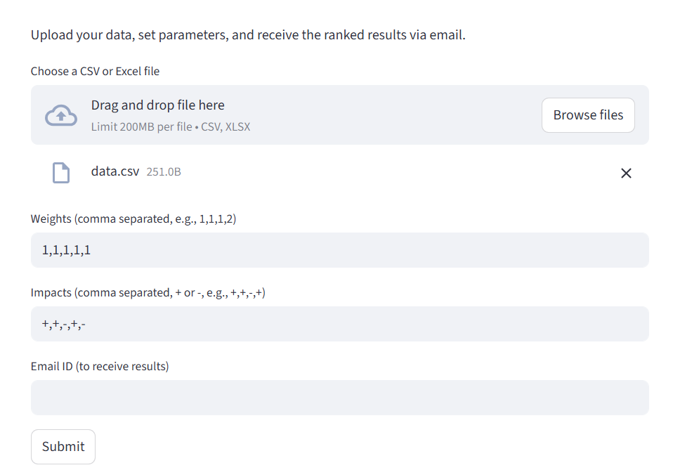
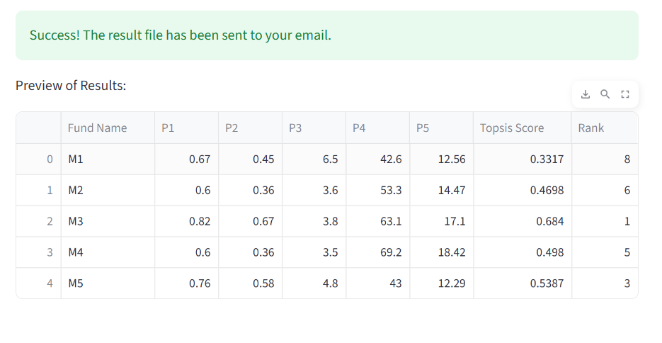

# TOPSIS-Sukhmanpreet-102313003

**TOPSIS (Technique for Order of Preference by Similarity to Ideal Solution)**  
Developed by **Sukhmanpreet Kaur**  
**Roll No:** 102313003  


[](https://pypi.org/project/Topsis-Sukhmanpreet-102313003/)
[](https://sukhmanpreet123-topsis-ucs654--app-dbuw8z.streamlit.app)


---

## 1.  Methodology

TOPSIS is a **multi-criteria decision-making (MCDM)** technique that ranks alternatives based on their **geometric distance** from the ideal solution.

### Algorithm Steps

1. **Normalize** the decision matrix using vector normalization  
2. **Apply weights** to each criterion based on importance  
3. **Identify ideal best and ideal worst** values for each criterion  
4. **Calculate Euclidean distances** from ideal best and worst  
5. **Compute relative closeness** (TOPSIS score in range 0–1)  
6. **Rank alternatives**, where **Rank 1 = Best option**

---

## 2.  Description

This project provides a **command-line based Python package** to perform TOPSIS analysis efficiently on real-world datasets.

### Features

- Upload CSV data containing multiple alternatives and criteria  
- Assign **custom weights** to criteria  
- Specify **impacts** (benefit or cost) for each criterion  
- Generate **TOPSIS scores and rankings**  
- Export results as a CSV file  

### Technology Stack

- **NumPy** – fast numerical computations  
- **Pandas** – robust data handling  
- **Python CLI** – easy-to-use command line interface  

---

## 3.  Input / Output

### 🔹 Input

- **CSV File**
  - First column → Alternative names  
  - Remaining columns → Numeric criteria values  

- **Weights**
  - Comma-separated numbers  
  - Example: `1,1,1,2`

- **Impacts**
  - `+` → Beneficial criterion  
  - `-` → Cost criterion  
  - Example: `+,+,-,+`

---

###  Output

- **CSV File** containing:
  - Original input data  
  - **Topsis Score** → Relative closeness (0–1)  
  - **Rank** → Final ranking (1 = best)

#### Example Output

| Model | C1 | C2 | C3 | C4 | Topsis Score | Rank |
|------|----|----|----|----|--------------|------|
| M1 | 0.85 | 0.72 | 4.5 | 120 | 0.6216 | 1 |
| M2 | 0.60 | 0.88 | 3.8 | 150 | 0.5669 | 2 |
| M3 | 0.92 | 0.65 | 4.1 | 110 | 0.5337 | 3 |

---
## Live Link
**Web App:**  
https://sukhmanpreet123-topsis-ucs654--app-dbuw8z.streamlit.app

**PyPI Package:**  
https://pypi.org/project/Topsis-Sukhmanpreet-102313003/

---
## 4. Screenshot of Interface
<p align="center">
  
  
</p>

---

##  Installation & Usage

### Prerequisites

```bash
python >= 3.8
```
### Run CLI

```bash

python topsis.py data.csv "1,1,1,1,1" "+,+,-,+,+" result.csv
```
### Run Web App

```bash
streamlit run app.py
```


